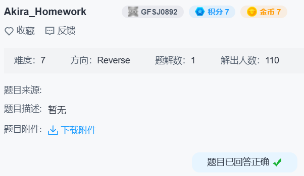

## akira-homework



`TlsCallback_0` 解密字符串。

```c
__int64 TlsCallback_0()
{
  HANDLE CurrentProcess; // rax
  __int64 result; // rax
  int i; // [rsp+20h] [rbp-18h]
  int j; // [rsp+24h] [rbp-14h]
  int k; // [rsp+28h] [rbp-10h]
  int m; // [rsp+2Ch] [rbp-Ch]

  if ( IsDebuggerPresent() )
  {
    MessageBoxA(0i64, "Stop debugging program!", "Error", 0x10u);
    CurrentProcess = GetCurrentProcess();
    TerminateProcess(CurrentProcess, 0xBABEFACE);
  }
  for ( i = 0; (unsigned __int64)i < 0x1A; ++i )
    aNtqueryinforma[i] ^= byte_140015F20[6];
  for ( j = 0; (unsigned __int64)j < 0x19; ++j )
    aZwqueryinforma[j] ^= byte_140015F20[7];
  for ( k = 0; (unsigned __int64)k < 0x11; ++k )
    aNtqueueapcthre[k] ^= byte_140015F20[8];
  for ( m = 0; ; ++m )
  {
    result = m;
    if ( (unsigned __int64)m >= 0xA )
      break;
    aNtdllDll[m] ^= byte_140015F20[5];
  }
  return result;
}
```

`byte_140015F20` 相关的字符串解密：

```python
f = lambda x, i, n: all(patch_byte(x + j, get_byte(x + j) ^ get_byte(0x140015F20 + i)) for j in range(n))
f(0x140015DA0, 0, 108)  # "My passwords is:"
f(0x140015E50, 3, 17)   # "WHO ARE YOU????\n"
f(0x140015E68, 4, 11)   # "Time out!\n"
f(0x140015E78, 5, 9)    # "ntdll.dll"
f(0x140015E88, 6, 26)   # "NtQueryInformationProcess"
f(0x140015EA8, 7, 25)   # "ZwQueryInformationThread"
f(0x140015EC8, 8, 17)   # "NtQueueApcThread"
f(0x140015EE0, 9, 22)   # "Failed to check sign!"
f(0x140015F08, 11, 22)  # L":signature"
f(0x140015EF8, 10, 14)  # "Have no sign!"
```

`main -> sub_140009C20 -> sub_140008850` 动态加载 ntapi。

```c
_BOOL8 __fastcall sub_140008850(_QWORD *a1)
{
  HMODULE hModule; // [rsp+28h] [rbp-10h]

  hModule = GetModuleHandleW(L"ntdll.dll");
  if ( !hModule )
    return 0i64;
  a1[1] = GetProcAddress(hModule, aNtqueryinforma);
  a1[2] = GetProcAddress(hModule, aZwqueryinforma);
  a1[3] = GetProcAddress(hModule, aNtqueueapcthre);
  return a1[1] && a1[2] && a1[3];
}
```

`StartAddress -> sub_140008D20` 创建 APC `sub_140009850`。

应该是加载解密后的 dll。

```c
v3 = dword_140011194;
v10 = operator new(dword_140011194);
v4 = v10;
memset(v10, 0, v3);
memcpy(v10, &byte_1400111A0, dword_140011194);
v11 = operator new(0x40ui64);
v8 = v11;
if ( *v10 == 'M' && *((_BYTE *)v4 + 1) == 'Z' )
  v1 = (unsigned int)sub_140007D80(v4, v3, 0i64, v8) == 0;
```

三处加密函数如下：

`_[0x100003]`

```c
char __fastcall sub_140008910(__int64 a1, const char *a2)
{
  int i; // [rsp+20h] [rbp-28h]
  int v4; // [rsp+24h] [rbp-24h]

  v4 = strlen(a2);
  for ( i = 0; i < dword_140011194; ++i )
  {
    if ( !(i % 3) )
      byte_1400111A0[i] ^= a2[i / 3 % v4];
  }
  SetEvent(Events[0]);
  return 1;
}
```

`_[0x100001]`

```c
char __fastcall sub_1400089E0(__int64 a1, _DWORD *a2)
{
  int i; // [rsp+20h] [rbp-18h]
  int v4; // [rsp+24h] [rbp-14h]

  v4 = *a2 ^ 51;
  for ( i = 0; i < dword_140011194; ++i )
  {
    if ( i % 3 == 1 )
      byte_1400111A0[i] ^= v4;
  }
  SetEvent(Events[1]);
  return 1;
}
```

`_[0x100002]`

```c
char sub_140008A80()
{
  int i; // [rsp+20h] [rbp-18h]

  for ( i = 0; i < dword_140011194; ++i )
  {
    if ( i % 3 == 2 )
      byte_1400111A0[i] = ((int)(unsigned __int8)byte_1400111A0[i] >> 4) | (16 * byte_1400111A0[i]);
  }
  SetEvent(Events[2]);
  return 1;
}
```

`sub_140009710` 输入密码：

```c
__int64 sub_140009710()
{
  unsigned __int8 v1; // [rsp+20h] [rbp-B8h]
  int i; // [rsp+24h] [rbp-B4h]
  __int64 v3; // [rsp+28h] [rbp-B0h] BYREF
  char v4[32]; // [rsp+30h] [rbp-A8h] BYREF
  char v5[109]; // [rsp+50h] [rbp-88h] BYREF

  v1 = 0;
  memset(v4, 0, 0x13ui64);
  memset(v5, 0, sizeof(v5));
  memcpy(v5, aAkiraSHomework, 108ui64);
  for ( i = 0; (unsigned __int64)i < 0x6C; ++i )
    aAkiraSHomework[i] ^= byte_140015F20[0];
  puts(aAkiraSHomework);
  sub_140009FF0("%18s", v4);
  if ( sub_140009200((__int64)v4) )
  {
    sub_140008300((__int64)&v3, 2i64, 0x100003);
    sub_140006C10(qword_140016178, v3, (__int64)v4);
    return 1;
  }
  return v1;
}
```

`sub_140009200` 检查密码：

```c
char __fastcall sub_140009200(__int64 a1)
{
  int j; // [rsp+20h] [rbp-78h]
  int k; // [rsp+24h] [rbp-74h]
  int i; // [rsp+28h] [rbp-70h]
  int v5[6]; // [rsp+40h] [rbp-58h]
  char v6[24]; // [rsp+58h] [rbp-40h] BYREF
  char v7[24]; // [rsp+70h] [rbp-28h] BYREF

  memset(v6, 0, 0x13ui64);
  memcpy(v6, &unk_140015E38, 0x12ui64);
  for ( i = 0; (unsigned __int64)i < 0x13; ++i )
    v6[i] ^= byte_140015F20[1];
  memset(v7, 0, 0x13ui64);
  for ( j = 0; (unsigned __int64)j < 0x12; ++j )
    v7[j] = j ^ *(_BYTE *)(a1 + j);
  v5[0] = 1;
  v5[1] = 5;
  v5[2] = 4;
  v5[3] = 2;
  v5[4] = 3;
  v5[5] = 0;
  for ( k = 0; (unsigned __int64)k < 0x12; ++k )
  {
    if ( v6[k] != v7[6 * (k / 6) + v5[k % 6]] )
      return 0;
  }
  return 1;
}
```

```python
# bytes(i ^ get_byte(0x140015F20 + 1) for i in get_bytes(0x140015E38, 0x12))
v6 = b'jZekqArhU|9g>0O}|d'
v7 = bytearray(0x12)
v5 = [1, 5, 4, 2, 3, 0]

for k in range(0x12):
    v7[6 * (k // 6) + v5[k % 6]] = v6[k]

for j in range(0x12):
    v7[j] ^= j

print(v7)  # bytearray(b'Akira_aut0_ch3ss_!')
```

随后以解密后的字符串为参数调用 `_[0x100003]`。

然后 `sub_1400093B0` 里打开 `FileName:signature`：

```c
GetModuleFileNameW(0i64, Filename, 0x208u);
for ( i = 0; (unsigned __int64)i < 22; ++i )
  *((_BYTE *)L":signature" + i) ^= byte_140015F20[11];
wcscat_s(Filename, 0x208ui64, L":signature");
hFile = CreateFileW(Filename, 0x80000000, 1u, 0i64, 3u, 0, 0i64);
```

`sub_140007DD0` 疑似 hash 函数，使用 findcrypt3 发现 MD5 函数特征。

查到 `md5("Overwatch") = FCAEEB6E34B4303E99B91206BD325F2B`。

```c
memset(v10, 0, sizeof(v10));
v0 = strlen(Buffer);
sub_140007DD0(Buffer, v0, (__int64)v10);
v8[0] = 0xFC;
v8[1] = 0xAE;
```

签名检查后传入 `_[0x100002]`。

`sub_140008300` 搜索交叉引用发现 `_[0x100001]` 是在 `StartAddress -> sub_140008B20` 调用的，传入 `106`。

```c
sub_140008300((__int64)&v7, 1i64, 0x100001);

v5 = 106;
if ( !byte_140016158 )
{
  sub_140006C10(qword_140016178, v7, (__int64)&v5);
  byte_140016158 = 1;
}
```

idapython 提取加密的 dll：

```python
with open('WinRev.bin', 'wb') as f:
    f.write(get_bytes(0x1400111A0, 19456))
```

写出解密脚本：

```python
with open('WinRev.bin', 'rb') as f:
    v = bytearray(f.read())

P = b'Akira_aut0_ch3ss_!'
for i in range(19456):
    match i % 3:
        case 0:
            v[i] ^= P[i // 3 % 18]
        case 1:
            v[i] ^= 89  # 106 ^ 51
        case 2:
            v[i] = ((v[i] >> 4) | (v[i] << 4)) & 0xFF

with open('WinRev.dll', 'wb') as f:
    f.write(v)
```

```c
char sub_180002880()
{
  HANDLE hFileMappingObject; // [rsp+30h] [rbp-88h]
  HANDLE hHandle; // [rsp+38h] [rbp-80h]
  void *v3; // [rsp+40h] [rbp-78h]
  void *Src; // [rsp+48h] [rbp-70h]
  char Str2[24]; // [rsp+50h] [rbp-68h] BYREF
  char Str1[24]; // [rsp+68h] [rbp-50h] BYREF
  char v7[16]; // [rsp+80h] [rbp-38h] BYREF

  memset(Str2, 0, 0x11ui64);
  puts("Now check the sign:");
  sub_1800027A0("%32s", Str2);
  hHandle = OpenEventW(0x1F0003u, 1, L"DLLInput");
  if ( !hHandle )
    return 0;
  WaitForSingleObject(hHandle, 0xFFFFFFFF);
  CloseHandle(hHandle);
  hFileMappingObject = OpenFileMappingW(0xF001Fu, 0, L"ShareMemory");
  if ( !hFileMappingObject )
    return 0;
  Src = MapViewOfFile(hFileMappingObject, 4u, 0, 0, 0x8000ui64);
  if ( Src )
  {
    CloseHandle(hFileMappingObject);
    v3 = malloc(0x8000ui64);
    memset(v3, 0, 0x8000ui64);
    memcpy(v3, Src, 0x8000ui64);
    strcpy(v7, "Ak1i3aS3cre7K3y");
    memset(Str1, 0, 0x11ui64);
    sub_180002800((__int64)v7, Str1, v3);
    if ( !strcmp(Str1, Str2) )
      sub_1800026F0("Get finally answer!\n");
    else
      sub_1800026F0("wow... game start!\n");
    return 1;
  }
  else
  {
    CloseHandle(hFileMappingObject);
    return 0;
  }
}
```

findcrypt3 发现用的 AES，密钥是 `b'Ak1i3aS3cre7K3y\x00'`。

使用 `key = 416b316933615333637265374b337900, iv = 0000000000000000000000000000000` 解密出 `b'flag{Ak1rAWin!}\x00'`

得到 `flag{Ak1rAWin!}`
