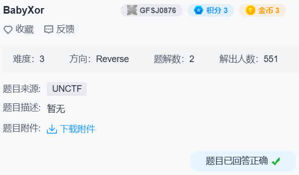

## babyxor



简单的异或加密壳，脱壳，patch 入口点偏移，移除 `.text` 段写权限。


```c
int __cdecl main_0(int argc, const char **argv, const char **envp)
{
  size_t v3; // eax
  int v5; // [esp+50h] [ebp-1Ch]
  void *v6; // [esp+54h] [ebp-18h]
  const char *Src; // [esp+58h] [ebp-14h]
  int v8; // [esp+5Ch] [ebp-10h]

  sub_4010B4((int)&unk_4395F0, (char *)&byte_432020);
  sub_40107D((int)sub_40102D);
  if ( --File._cnt < 0 )
    _filbuf(&File);
  else
    ++File._ptr;
  v8 = sub_40108C(&dword_435DC0, 56);
  Src = (const char *)sub_401041((int)&dword_435DC0, (int)&dword_435DF8, 0x38u);
  v6 = malloc(0x64u);
  v3 = strlen(Src);
  memcpy(v6, Src, v3);
  v5 = sub_4010C3((int)&dword_435DC0, (int)Src, (int)&dword_435E30, 56);
  sub_40101E(v8, (int)Src, v5);
  return 0;
}
```

这里的鱼很警惕.jpg

```
.data:00435DC0 dword_435DC0    dd 'f', 'm', 'c', 'd', 7Fh, '7'
.data:00435DD8                 dd '5', 2 dup('0'), 'k', ':', '<', ';'
.data:00435DF4                 dd ' '
```

```python
print(bytes(x ^ y for x, y in enumerate(b'fmcd\x7f7500k:<; ')))  # b'flag{2378b077-'
```

其实这边可以直接动调了。

动调 `sub_401041` 和 `sub_4010C3` 得到另外两部分：

```
debug032:005D07F0 a7d6e4564Bdca   db '7d6e-4564-bdca',0
```

```
.data:00439558 db '-'
.data:00439559 db '7'
.data:0043955A db 'e'
.data:0043955B db 'e'
.data:0043955C db 'c'
.data:0043955D db '8'
.data:0043955E db 'e'
.data:0043955F db 'e'
.data:00439560 db 'd'
.data:00439561 db 'e'
.data:00439562 db '9'
.data:00439563 db 'a'
.data:00439564 db '2'
.data:00439565 dd '}'
```

最后得到 `flag{2378b077-7d6e-4564-bdca-7eec8eede9a2}`
