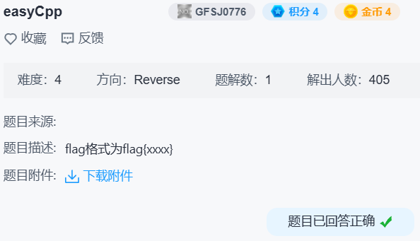

## easycpp



上来就是用户输入加上初始化一个等长的斐波那契数列。

```c++
for ( i = 0; i <= 15; ++i )
{
  scanf("%d", &v28[i]);
  std::vector<int>::push_back(v22, &v28[i]);
}
for ( j = 0; j <= 15; ++j )
{
  LODWORD(v27[0]) = fib(j);
  std::vector<int>::push_back(a1, v27);
}
```

`transform` 这边很简单，就是除第一个元素外其他元素的值加上第一个元素的值。

```c++
// v26.append(v25[0])
std::vector<int>::push_back(v23, v28);
v4 = std::back_inserter<std::vector<int>>(v23);
v5 = std::vector<int>::end(v22);
v27[0] = std::vector<int>::begin(v22);
v6 = __gnu_cxx::__normal_iterator<int *,std::vector<int>>::operator+(v27, 1LL);
// v26.extend(map(lambda x: x - v25[0], v25[1:]))
std::transform<__gnu_cxx::__normal_iterator<int *,std::vector<int>>,std::back_insert_iterator<std::vector<int>>,main::{lambda(int)#1}>(
  v6,
  v5,
  v4,
  (__int64)v28);
```

```c++
__int64 __fastcall main::{lambda(int)#1}::operator()(_DWORD **a1, int a2)
{
  return (unsigned int)(**a1 + a2);
}
```

`accumulate` 这边复杂一点，lambda 用 `back_inserter` 实现了一个 `front_inserter`，最终实现 `list.reverse()` 的效果。

```c++
std::vector<int>::vector((__int64)v26);
v7 = std::vector<int>::end(v23);
v8 = std::vector<int>::begin(v23);
// v26.reverse()
std::accumulate<__gnu_cxx::__normal_iterator<int *,std::vector<int>>,std::vector<int>,main::{lambda(std::vector<int>,int)#2}>(
  (__int64)v27,
  v8,
  v7,
  (__int64)v26,
  v9,
  v10,
  v3);
```

```c++
__int64 __fastcall main::{lambda(std::vector<int>,int)#2}::operator()(__int64 r, __int64 a2, __int64 v, int it)
{
  __int64 I; // r12
  __int64 end; // rbx
  __int64 begin; // rax
  int it_1; // [rsp+4h] [rbp-3Ch] BYREF
  __int64 v_1; // [rsp+8h] [rbp-38h]
  __int64 v10; // [rsp+10h] [rbp-30h]
  __int64 r_1; // [rsp+18h] [rbp-28h]
  unsigned __int64 v12; // [rsp+28h] [rbp-18h]

  r_1 = r;
  v10 = a2;
  v_1 = v;
  it_1 = it;
  v12 = __readfsqword(0x28u);
  std::vector<int>::vector(r);                  // []
  std::vector<int>::push_back(r, &it_1);        // [it]
  I = std::back_inserter<std::vector<int>>(r_1);
  end = std::vector<int>::end(v_1);
  begin = std::vector<int>::begin(v_1);
  std::copy<__gnu_cxx::__normal_iterator<int *,std::vector<int>>,std::back_insert_iterator<std::vector<int>>>(
    begin,
    end,
    I);
  return r_1;                                   // [it, ...]
}
```

然后比较两个数列，成功的话打印 flag。

```c++
if ( (unsigned __int8)std::operator!=<int,std::allocator<int>>(v24, a1) )
{
  puts("You failed!");
  exit(0);
}
puts("You win!");
printf("Your flag is:flag{");
v26[0] = std::vector<int>::begin(v25);
v27[0] = std::vector<int>::end(v25);
while ( (unsigned __int8)__gnu_cxx::operator!=<int *,std::vector<int>>(v26, v27) )
{
  v17 = (unsigned int *)__gnu_cxx::__normal_iterator<int *,std::vector<int>>::operator*(v26);
  std::ostream::operator<<(&std::cout, *v17);
  __gnu_cxx::__normal_iterator<int *,std::vector<int>>::operator++(v26);
}
putchar(125);
```

反推一下输入：

```python
from functools import lru_cache
fib = lru_cache(lambda x: x if x < 2 else fib(x - 1) + fib(x - 2))
v = list(map(fib, range(1, 17)))
v.reverse()
print(v[0], *map(lambda x: x - v[0], v[1:]))
```

```
$ ./easyCpp
987 -377 -610 -754 -843 -898 -932 -953 -966 -974 -979 -982 -984 -985 -986 -986
You win!
Your flag is:flag{987-377-843-953-979-985}
```

得到 `flag{987-377-843-953-979-985}`。
