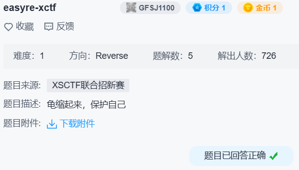

## easyre-xctf



一眼 upx。

```
.data:0000000000403010 f_part2         db 'd_0n3_4nd_tw0}',0
```

```c
.text:0000000000401530 _Z5part1v       proc near
.text:0000000000401530                 push    rbp
.text:0000000000401531                 mov     rbp, rsp
.text:0000000000401534                 sub     rsp, 10h
.text:0000000000401538                 mov     rax, 5850557B67616C66h
.text:0000000000401542                 mov     [rbp+var_10], rax
.text:0000000000401546                 mov     [rbp+var_8], 6E345Fh
.text:000000000040154D                 add     rsp, 10h
.text:0000000000401551                 pop     rbp
.text:0000000000401552                 retn
.text:0000000000401552 _Z5part1v       endp
```

得到 `flag{UPX_4nd_0n3_4nd_tw0}`。
