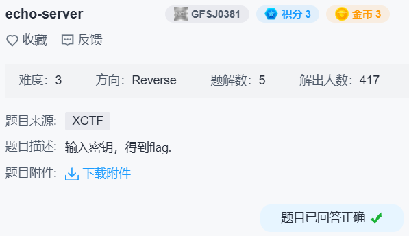

## echo-server



发现一些典型的花指令：

```
.text:080487BD                 jz      short locret_80487C2
.text:080487BF                 jnz     short locret_80487C2
.text:080487C1                 db 0E8h

.text:080487F3                 db 0EBh
.text:080487F4                 inc     eax
.text:080487F6                 dec     eax

.text:08048812                 xor     eax, eax
.text:08048814                 jz      short loc_804881D
.text:08048816                 db 0E9h

.text:08048848                 mov     eax, ds:dword_804A088
.text:0804884D                 test    eax, eax
.text:0804884F                 jz      short loc_8048866
.text:08048851                 db  66h ; f
```

patch 之后 ida 能正常生成伪代码。

有个死循环应该跟 `You are very close! Now patch me~` 有关，反正我直接改成 jmp 了。

```c
memset(s, 0, sizeof(s));
read(0, s, 0x14u);
if ( !strncmp(s, "F1@gA", 5u) )
{
  puts("You are very close! Now patch me~");
  v0 = strlen(s);
  v3 = (unsigned __int8 *)MD5((int)&s[1], v0, 0);
  sub_804875D(v3, 0x10u);
}
```

```bash
$ echo 'F1@gA' | ./1b1533ea475c43d69831bee12da9b664
```

这里 `MD5()` 传入的是 `"1@gA\n\0"`，偏移为 1 但是长度仍为 6。

注意后面打印的时候用的 `%02X`。

```bash
$ printf '1@gA\n\0' | md5sum | tr '[:lower:]' '[:upper:]'
F8C60EB40BF66919A77C4BD88D45DEF4 *-
```
