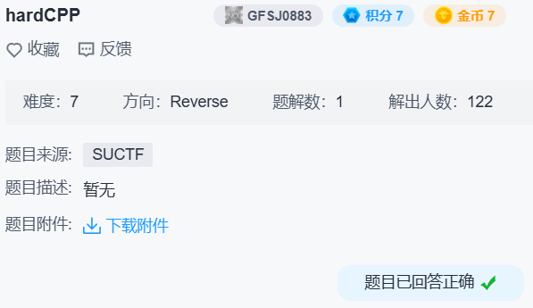

## hardcpp



ida 打开发现是 ollvm 类型的题。

deflat 以下地址：

```
4007E0
401310
4014E0
4016C0
```

patch 不透明谓词：

```python
from capstone import *
from keystone import *

from ida_bytes import *
from ida_idaapi import *
from ida_kernwin import *
from ida_xref import *

d = Cs(CS_ARCH_X86, CS_MODE_64)
d.detail = True

a = Ks(KS_ARCH_X86, KS_MODE_64)

for i in range(*read_range_selection(None)[1:]):
    x = get_first_dref_to(i)
    while x != BADADDR:
        t = next(d.disasm(get_bytes(x, 16), x, 1))
        if t.mnemonic == 'mov' and len(t.operands) == 2 and t.operands[0].type == CS_OP_REG:
            p = a.asm('xor {0}, {0}'.format(t.reg_name(t.operands[0].value.reg)), x, True)[0]
            p += b'\x90' * (t.size - len(p))
            patch_bytes(x, p)
        x = get_next_dref_to(i, x)

```

之后 ida 可生成正常的伪代码。

```c
int __fastcall main(int argc, const char **argv, const char **envp)
{
  char v3; // al
  char v4; // al
  char v5; // al
  char v6; // al
  char v8[8]; // [rsp+A0h] [rbp-90h] BYREF
  char v9[8]; // [rsp+A8h] [rbp-88h] BYREF
  char v10[8]; // [rsp+B0h] [rbp-80h] BYREF
  char v11[8]; // [rsp+B8h] [rbp-78h] BYREF
  char v12[8]; // [rsp+C0h] [rbp-70h] BYREF
  char v13[7]; // [rsp+C8h] [rbp-68h] BYREF
  char v14; // [rsp+CFh] [rbp-61h]
  int i; // [rsp+D0h] [rbp-60h]
  int v16; // [rsp+D4h] [rbp-5Ch]
  int v17; // [rsp+D8h] [rbp-58h]
  int v18; // [rsp+DCh] [rbp-54h]
  char s[22]; // [rsp+E0h] [rbp-50h] BYREF
  char v20[8]; // [rsp+F8h] [rbp-38h] BYREF
  char v21[8]; // [rsp+100h] [rbp-30h] BYREF
  char v22[8]; // [rsp+108h] [rbp-28h] BYREF
  char v23[4]; // [rsp+110h] [rbp-20h] BYREF
  int v24; // [rsp+114h] [rbp-1Ch]
  const char **v25; // [rsp+118h] [rbp-18h]
  int v26; // [rsp+120h] [rbp-10h]
  int v27; // [rsp+124h] [rbp-Ch]
  int v28; // [rsp+128h] [rbp-8h]
  bool v29; // [rsp+12Eh] [rbp-2h]

  v27 = 0;
  v26 = argc;
  v25 = argv;
  v24 = time(0LL);
  puts("func(?)=\"01abfc750a0c942167651c40d088531d\"?");
  s[0] = getchar();
  fgets(&s[1], 21, stdin);
  v18 = time(0LL);
  v17 = v18 - v24;
  v28 = v18 - v24;
  v16 = strlen(s);
  v29 = v16 != 21;
  for ( i = 1; i < 21; ++i )
  {
    do
    {
      // v14 = s[i];
      v14 = v17 ^ s[i];
      // v13 = v14;
      v13[0] = get_a2(v22, (unsigned int)v14);
      // v12 = s[i - 1];
      v12[0] = get_a2_0(v20, (unsigned int)s[v17 - 1 + i]);
      // v3 = v12 % 7;
      v3 = mod(v12, 7);
      // v14 = v13 + v3;
      v14 = add((__int64)v13, v3);
      // v11 = v14;
      v11[0] = get_a2_1((__int64)v23, v14);
      // v10 = s[i - 1];
      v10[0] = get_a2_1((__int64)v23, s[v17 - 1 + i]);
      // v4 = v10 ^ 18;
      v4 = xor(v10, 18);
      // v9 = v4;
      v9[0] = get_a2_2((__int64)v21, v4);
      // v5 = v9 * 3;
      v5 = mul(v9, 3);
      // v8 = v5;
      v8[0] = get_a2(v22, (unsigned int)v5);
      // v6 = v8 + 2;
      v6 = add((__int64)v8, 2);
      // v14 = v11 ^ v6;
      v14 = xor(v11, v6);
    }
    while ( enc[i - 1] != v14 );
  }
  puts("You win");
  return 0;
}
```

`md5('#') = 01abfc750a0c942167651c40d088531d`

爆破一下：

```python
t = bytes.fromhex('F32E1836E14C22D1F98C4076F40E0005A3900EA5')
f = lambda x, y: ((y + (x % 7)) ^ (((x ^ 18) * 3) + 2)) & 0xFF
r = bytearray(21)
r[0] = ord('#')

for i in range(1, 21):
    for j in range(256):
        if f(r[i - 1], j) == t[i - 1]:
            r[i] = j
            break

print(r)  # bytearray(b'#flag{mY-CurR1ed_Fns}')
```

得到 `flag{mY-CurR1ed_Fns}`。
