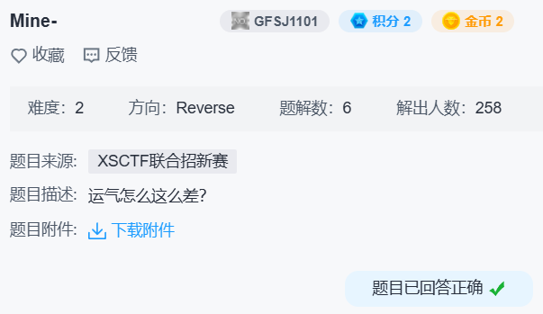

## mine



```c
for ( i4 = 0; i4 < v15; ++i4 )
{
  v6 = (_BYTE *)std::string::operator[](&ans, i4);
  std::operator<<<std::char_traits<char>>(refptr__ZSt4cout, (unsigned int)(char)((v15 - i4) ^ *v6));
}
```

交叉引用查到构造函数：

```c
std::string::string(&ans, "*ur)O}t@r{u!c&|}d\\9m>M4NtsrjL", v3);
```

解密脚本

```python
t = b'*ur)O}t@r{u!c&|}d\\9m>M4NtsrjL'
n = len(t)
r = bytearray(n)

for i in range(n):
    r[i] = (n - i) ^ t[i]

print(r)  # bytearray(b'7ii3VecVgof3r6ssiP2g7E3HqwqhM')
```

猜测是 base 系列编码，发现用的 base58，但是表用的 `[1-9a-zA-Z]` 而非 `[1-9A-Za-z]`。

得到 `flag{h4pp4-M1n3-G4m3}`。
