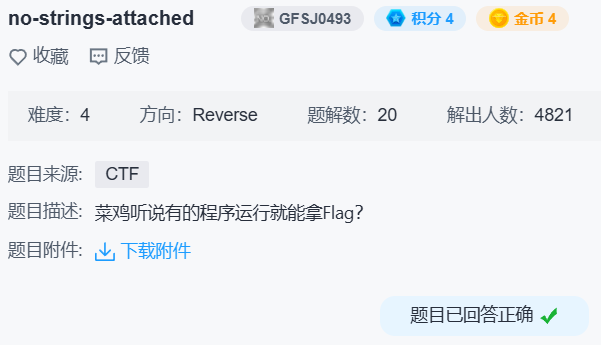

## no-strings-attached



```c
wchar_t *__cdecl decrypt(wchar_t *s, wchar_t *a2)
{
  size_t v2; // eax
  signed int v4; // [esp+1Ch] [ebp-1Ch]
  signed int i; // [esp+20h] [ebp-18h]
  signed int v6; // [esp+24h] [ebp-14h]
  signed int v7; // [esp+28h] [ebp-10h]
  wchar_t *dest; // [esp+2Ch] [ebp-Ch]

  v6 = wcslen(s);
  v7 = wcslen(a2);
  v2 = wcslen(s);
  dest = (wchar_t *)malloc(v2 + 1);
  wcscpy(dest, s);
  while ( v4 < v6 )
  {
    for ( i = 0; i < v7 && v4 < v6; ++i )
      dest[v4++] -= a2[i];
  }
  return dest;
}
```

```python
from itertools import cycle
a1 = bytes.fromhex('3a14000036140000371400003b140000801400007a14000071140000'
                   '78140000631400006614000073140000671400006214000065140000'
                   '73140000601400006b14000071140000781400006a14000073140000'
                   '7014000064140000781400006e140000701400007014000064140000'
                   '70140000641400006e1400007b14000076140000781400006a140000'
                   '731400007b14000080140000').decode('utf-32-le')
a2 = bytes.fromhex('0114000002140000031400000414000005140000').decode('utf-32-le')
bytes(ord(x) - ord(y) for x, y in zip(a1, cycle(a2)))
```
