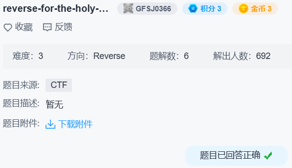

## reverse-for-the-holy-grail-350



`validChars` 要求 `(v[i] & ~0x20) - 'A' >= 26 && v[i] != '?'`。

也就是不能有`[\]^_{|}~`。

然后是 `stringMod`：

```c
do
{
  v12 = *(v2 + v3);
  v14[v3] = v12;
  if ( 3 * (v3 / 3) == v3 && v12 != firstchar[v3 / 3] )
    v4 = -1;
  ++v3;
}
while ( v3 != v1 );
```

```c
v7 = 666;
do
{
  *v6 = v7 ^ *v6;
  v7 += v7 % 5;
  ++v6;
}
while ( &v15 != v6 );
```

```c
v10 = 1;
v11 = 0;
do
{
  if ( v11 == 2 )
  {
    if ( *v5 != thirdchar[v9] )
      v4 = -1;
    if ( v10 % *v5 != masterArray[v9] )
      v4 = -1;
    ++v9;
    v10 = 1;
    v11 = 0;
  }
  else
  {
    v10 *= *v5;
    if ( ++v11 == 3 )
      v11 = 0;
  }
  ++v8;
  ++v5;
}
while ( v8 != 19 );
```

`v7` 是固定的所以很容易得到异或表。

异或后的 `firstchar` 加上 `thirdchar` 能得到不完整的异或后的表，剩下的就是爆破了。

```python
# firstchar = [65, 105, 110, 69, 111, 97]
# thirdchar = [751, 708, 732, 711, 734, 764]
masterArray = [471, 12, 580, 606, 147, 108]
t = [666, 667, 669, 673, 676, 677, 679, 683, 686, 687, 689, 693, 696, 697, 699, 703, 706, 707]
v = [731, 0, 751, 712, 0, 708, 713, 0, 732, 746, 0, 711, 727, 0, 734, 734, 0, 764]

for i in range(6):
    v10 = v[3*i]
    for y in range(0x7F):
        if y in b'[\\]^_{|}~':
            continue
        x = y ^ t[3*i+1]
        if (v10 * x) % v[3*i+2] == masterArray[i]:
            v[3*i+1] = x
            break

print(bytes(x ^ y for x, y in zip(v, t)))  # b'AfricanOrEuropean?'
```

交上去不对，上网查了 flag 格式是 `tuctf{}`。

答案是 `tuctf{AfricanOrEuropean?}`。
