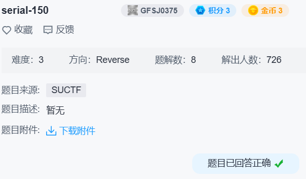

## serial-150



发现挺多花指令：

```
.text:00000000004009DB 66 B8 EB 05                    mov     ax, 5EBh
.text:00000000004009DF 31 C0                          xor     eax, eax
.text:00000000004009E1 74 FA                          jz      short near ptr loc_4009DB+2
.text:00000000004009E3 E8 BE AC 0D 40                 call    near ptr 404DB6A6h
```

直接把 `66B8EB0531C074FAE8` patch 成 `909090909090909090` 即可。

```c
if ( strlen(s) != 16 )
  goto LABEL_19;
if ( s[0] != 'E' )
  goto LABEL_19;
if ( s[15] != 'V' )
  goto LABEL_19;
if ( s[1] == 'Z'
  && s[14] == 'A'
  && s[2] == '9'
  && s[13] == 'b'
  && s[3] == 'd'
  && s[12] == '7'
  && s[4] == 'm'
  && s[11] == 'G'
  && s[5] == 'q'
  && s[10] == '9'
  && s[6] == '4'
  && s[9] == 'g'
  && s[7] == 'c'
  && s[8] == '8' )
{
  std::operator<<<std::char_traits<char>>(&std::cout, "Serial number is valid :)\n");
  return 0;
}
```

得到 `EZ9dmq4c8g9G7bAV`。
