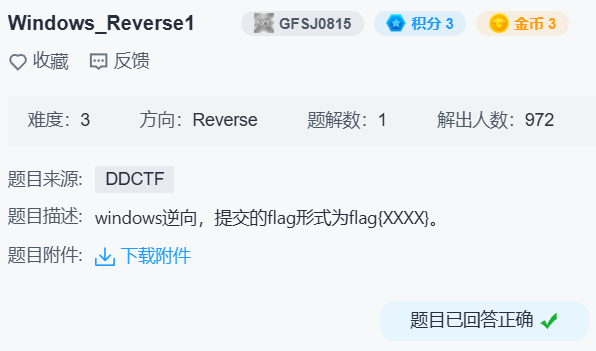

## windows-reverse1



一眼 upx。

发现 `sub_401000` 传参有些奇怪，改一下函数签名：

```c
void __usercall sub_401000(const char *u, const char *v@<ecx>)
{
  unsigned int i; // edi
  int x; // ebx

  i = 0;
  if ( strlen(u) )
  {
    x = u - v;
    do
    {
      *v = byte_402FF8[v[x]];
      ++i;
      ++v;
    }
    while ( i < strlen(u) );
  }
}
```

这里 `v[x]` 就是 `u[i]`，很明显是查表替换。

```
.data:00403018 aZyxwvutsrqponm db '~}|{zyxwvutsrqponmlkjihgfedcba`_^]\[ZYXWVUTSRQPONMLKJIHGFEDCBA@?>'
.data:00403059                 db '=<;:9876543210/.-,+*)(',27h,'&%$#"! ',0
```

注意到 `0x00403018 - 0x00402FF8 = 0x20`，写出解密脚本：

```python
t = b'~}|{zyxwvutsrqponmlkjihgfedcba`_^]\[ZYXWVUTSRQPONMLKJIHGFEDCBA@?>=<;:9876543210/.-,+*)(\'&%$#"! '
print(bytes(t[i-0x20] for i in b'DDCTF{reverseME}'))  # b'ZZ[JX#,9(9,+9QY!'
```

得到 `flag{ZZ[JX#,9(9,+9QY!}`。
