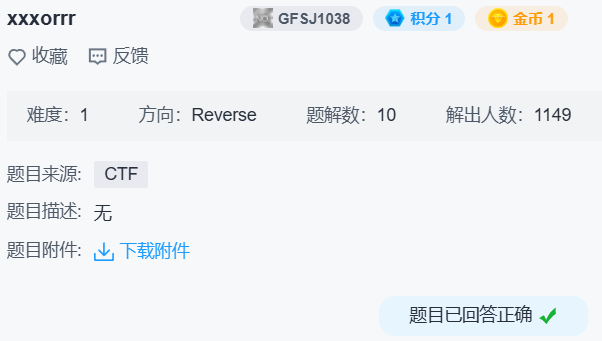

## xxxorrr



查 `s1` 引用发现构造函数里进行了一次异或：

```c
for ( i = 0; i <= 33; ++i )
  s1[i] ^= 2 * i + 65;
```

主函数进行了一次异或：

```c
for ( i = 0; i <= 33; ++i )
  s1[i] ^= s[i];
```

写出解密脚本：

```python
s1 = bytes((y ^ (2 * x + 65)) & 0xFF for x, y in enumerate(b'qasxcytgsasxcvrefghnrfghnjedfgbhn\x00'))
s2 = b'VNWXQQ\x09F\x17FTZYY\x1FH2[k|un~n/wOzqC+&\x89\xFE'
print(bytes(x ^ y for x, y in zip(s1, s2)))
```

得到 `flag{c0n5truct0r5_functi0n_in_41f}`。
